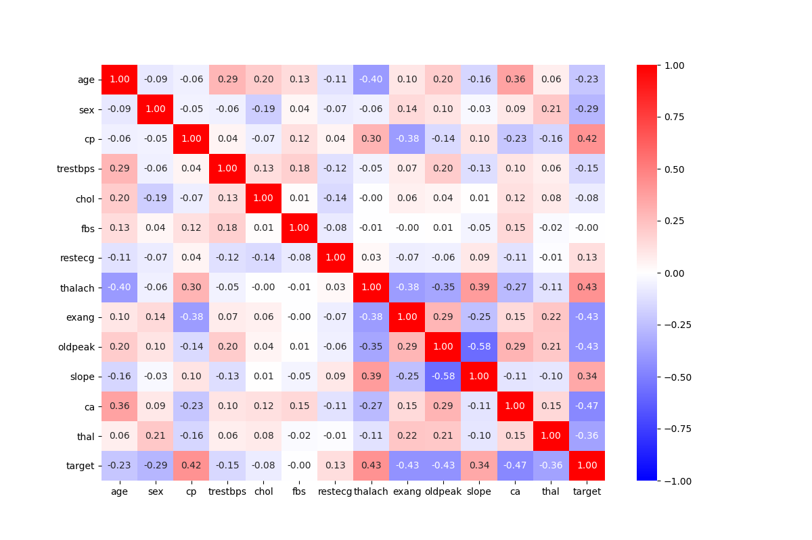
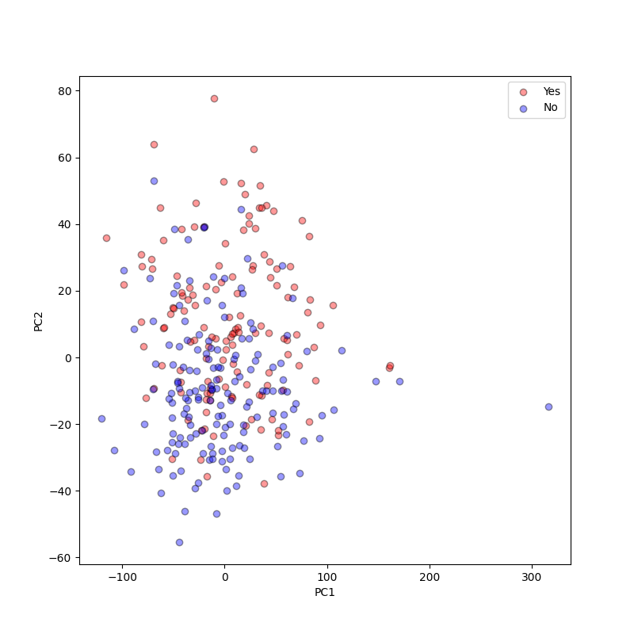
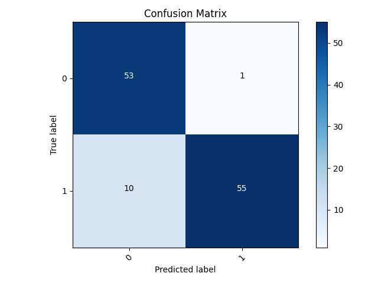

***HEART DATA***

**QUESTION/PROBLEM:**

Can I create a binary model that is able to predict if someone is in the early stages of heart disease?

Heart disease is a leading cause of death and is often diagnosed too late, so doctors need a way
to identify early signs of the disease and anticipate the diagnosis.

**ABSTRACT:**

Cardiovasular disease is one of the top (if not *the* top) causes of death in the world. Besides educating the 
public on ways to avoid the illness, scientists want to be able to detect the disease early
before too much damage has been done. My goal is to build a model that will be able to accurately predict whether or not 
someone is going to develop heart disease in the future or determine if they are in the early stages of it.
I plan on using a tensorflow binary model with split into training, testing, and validation batches to teach the
model what measurements and values are consistent with individuals who have been diagnosed with heart disease in 
the past. The data set I will use to train collects 14 different data points from around 300 different 
individuals that either developed the disease or did not. Getting a high accuracy on the model
would be beneficial to doctors, as they can start treatment as soon as possible and hopefully save
the person's life.

**DATA STRUCTURE:**

This dataset from kaggle looks at several different aspects and measurements of individuals in the context of how likely they
are to develop heart disease. The set has about 303 different entries, and there are 14 different features I'm using, and all of them are numeric. However, there is
a mix of discrete and continuous. I selected the final feature (whether or not the individual developed heart disease) to be my target
because I intend to find the features that most closely correlate to this outcome in order to build a model that will 
be able to predict the likelihood of a particular person developing heart disease based off of these correlated measurements.

To see what was most correlated with the target, I created a heatmap with all of the features. Luckily, all the values were 
already numeric, so I didn't have to transform any from strings. I also dropped any null values that could specifically be found 
in the thal and colored vessels features. The data still needs to be standardized because there are several different units of
measurement throughout the dataset.

Looking at the heatmap with all of the variables, the features that are the most correlated with our target include the colored
vessels, exercise-induced angina, oldpeak, maximum heart rate achieved, and chest pain type. The validity of map can be clearly seen 
because the most correlated pair is the slope and the oldpeak. It is clear from the descriptions of the the features that they are 
related to each other and have a correlation of -0.58. When trying to build the model, I will use these predictions to create crossed feature
columns and other numeric feature columns.

One of the downfalls of this dataset is its size. Because there are only 303 different entries, the splits for testing, training, and validation are 
very small (188 training, 48 validation, 60 test). However, the dataset has a relatively equal proportion of idividuals that
did end up developing heart disease and those that didn't (138 diagnosed vs 165 healthy).

For the last part of my data interrogation, I wanted to see a graph that labeled each point as healthy or unhealthy
and compared all the features (multi-dimensional), so I made a PCA graph.

[Final Presentation!](https://drive.google.com/file/d/1cbNagNN1U8uRtUH0TkWhdliLC0NmN473/view?usp=sharing)