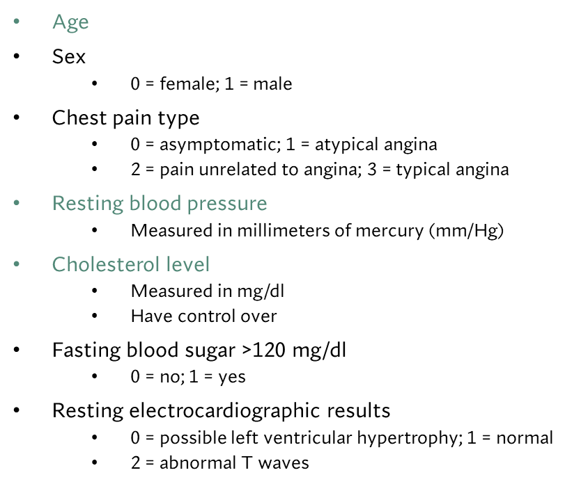
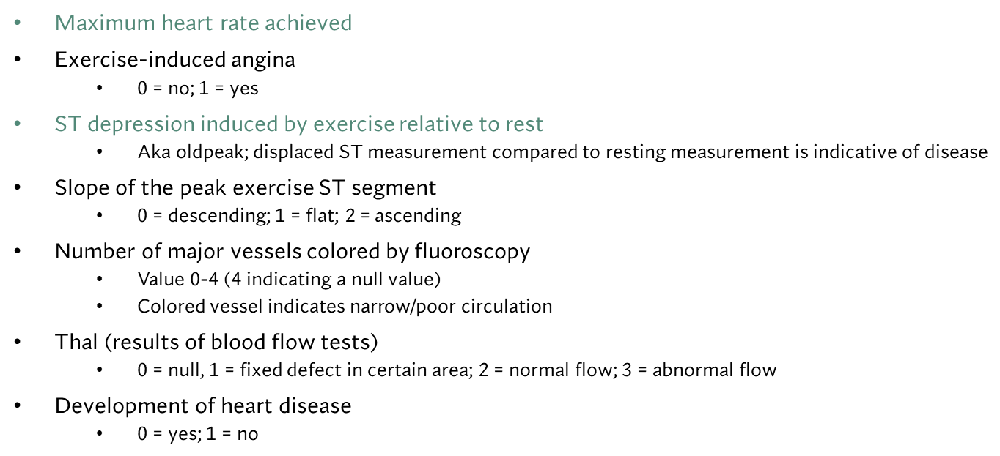

*ABSTRACT*

Genetic mutations happen spontaneously and constantly. In the past decade, scientists
have seen worrying mutations develop in the DNA of bacterial genomes that make them resistant
to antibiotic treatments and provide them with other novel ways to survive. Given the vast number of
bacterial species both known and unknown across the world, it's important to keep track
of these genetic differences because they can be passed between bacteria in several ways.
Using machine learning and training models, my goal is to read over collections of genetic sequences
from several different species, and determine whether or not there are any new sequences that were
not present in the training data. These novel sequences are referred to as "out-of distribution" or OOD 
and can indicate mutations to watch out for. Teaching the model how to determine if specific genes
contain OODs with high levels of accuracy will save scientists lots of time and let them focus on developing
solutions, as they don't have to manually read through the genomes.

***HEART DATA***

**DATA STRUCTURE**

This dataset looks at several different aspects and measurements of individuals in the context of how likely they
are to develop heart disease. There are 14 different features I'm using, and all of them are numeric. However, there is
a mix of categorical and continuous. The images below describe the features in more detail and indicate categorical vs. continuous
with the green text representing continuous. I selected the final feature (whether or not the individual developed heart disease) to be my target
because I intend to find the features that most closely correlate to this outcome in order to build a model that will 
be able to predict the likelihood of a particular person developing heart disease based off of these correlated measurements.

To see what was most correlated with the target, I created a heatmap with all of the features. Luckily, all the values were 
already numeric, so I didn't have to transform any from strings. I also dropped any null values that could specifically be found 
in the thal and colored vessels features. The data still needs to be standardized because there are several different units of
measurement throughout the dataset.

Looking at the heatmap with all of the variables, the features that are the most correlated with out target include 

