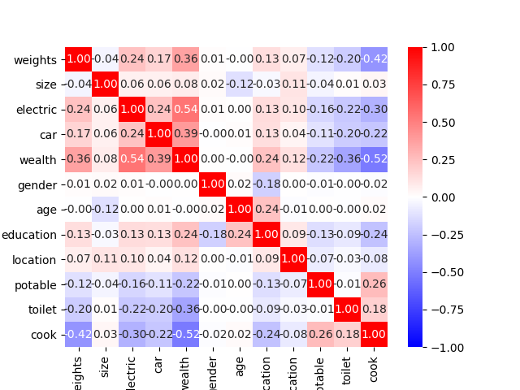
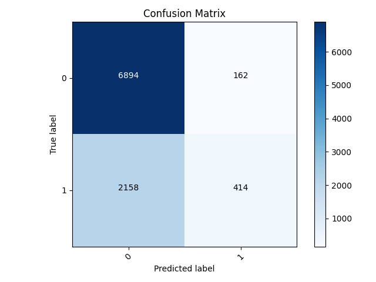
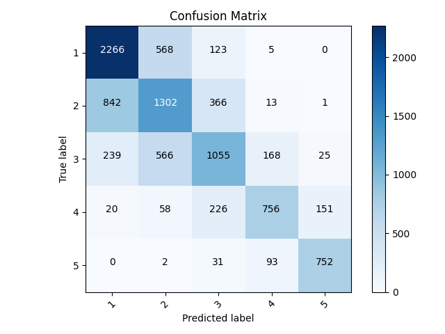

**PROJECT 3**

1. Using the country_persons dataset with about 48,219, I first dropped all the rows with values that were
missing or unknown then dropped the hhid, pnmbr, and unit features. I wanted to use crossed columns, but wanted
   to make sure the features I chose were at least a little correlated. In order to use all the features in the heatmap,
   I had to transform some of them from strings to integers. For location, potable, toilet, and cook, I used the ordinal encoder
   to temporarily have them be numerical data columns. The heatmap below shows that wealth is correlated the most with cook, 
   electric, and weights. I also noticed that weights and cook were the next most related items. I chose these two to be 
   in the crossed features column. I also changed electric and car into numeric columns, making No's turn into 0s and anything
   else turn into 1's. I also tried doing this with gender by making 1's males and so on, but this seemed to lower my accuracies.
   In addition, I tried using the loop for toilet to split it into 3 different buckets, but this also messed with my accuracies.

1a. After splitting the data into train, test, and split, I created my feature columns. My final model used the following
columns:

BATCH = 32; EPOCHS = 30; DROPOUT = 0.1

NUMERIC = size, age, education, electric, car, gender 

BUCKETIZED = age (10's), weights (1's)

INDICATOR = location, potable, toilet, cook

CROSSED = cook and weights

I tried many combinations of feature columns, such as having electric, car, and gender as indicators, removing location, and making cook
numeric. I also attempted to change the hash_bucket_size for the crossed column from 100 to 200, which was unsuccessful.

I played a lot with the number of epochs, going up to 50. However, around this number, I noticed the model became slighly more overfit
because the training accuracy was much higher than the validation accuracy which stayed about the same after only a few epochs. The dropout was also adjusted to about 0.25
but the accuracy always stayed around 0.965.

My best result and correlation matrix was from wealth class 5. The testing accuracy was about 0.9723.
The model did a good job of correctly predicting labels except for 267/9,361. For 148 examples, the model predicted 0
when the answer was actually 1 and for 119, the model predicted 1 when the actual label was 0. The model was most likely more accurate with wealth = 5
above all other classes because it had the least amount of variation among its points. Wealth 5 had the smallest number of data points, and the feature values were the
most different from other wealth feature values.

_matrix.png) 

My worst result was from wealth class 2 and got an accuracy of 0.7636. For this model, it had the most trouble when the true label was 1. For 2,158 samples, it incorrectly predicted them to be 
0's. However, it was much better at correctly identifying when a sample was 0. Overall, the model tended to predict samples as 0 (or wealth class 2) even when they weren't more often than misidentifying true 0 samples.

2. For the sparse categorical model, I focused on aspects such as adding a flatten layer to the model and changing the activation and loss metrics.
Again, I tried to loop through the toilet feature to split it up and to switch gender, car, and electric between strings and integers.
   Ultimately, I ended up sticking with the feature columns that I used in the previous binary model. However, I changed the dropout to 0.25 and made the activation softmax instead of sigmoid.
   I also had to make sure that the dense layer had 6 instead of 1.
   
My final accruacy for all of the wealth classes was 0.64. For all outcomes, it correctly predicted the majority of the samples.
Where it struggled the most was in the middle with classes of 2,3,and 4. In general, the model underpredicted, meaning that when the sample was actually
a 2, the most popular incorrect label was 1 or for a sample that was actually 3, the most common incorrect label was 2. It had the most trouble with these wealth classes because they had a lot a samples in them and there was more variation among the feature values
where these outputs could overlap. In other words, the distinction between classes at this point was not as defined as it was for wealth 1 and 5.

