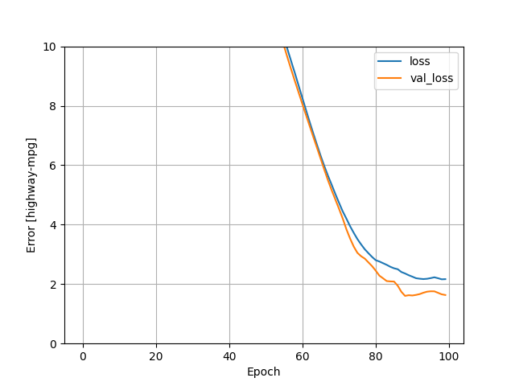
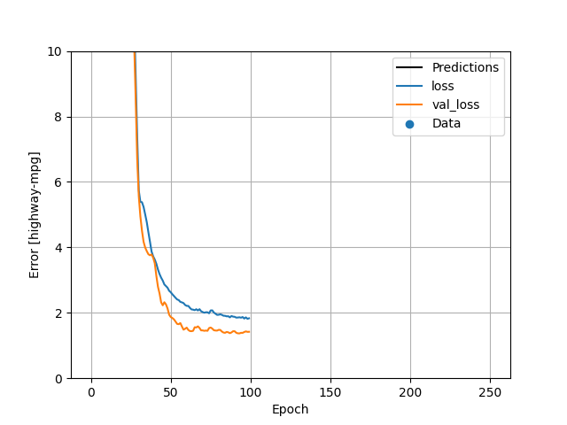
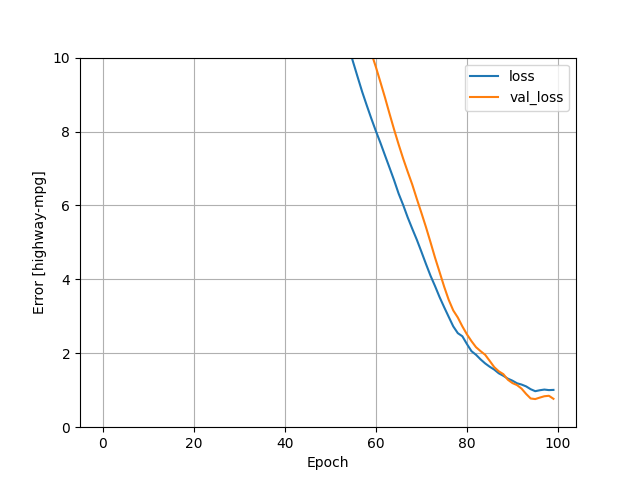

###AUTO IMPORTS

1. Between the multi-class linear and multi-class DNN regression, the linear model performed slightly better
getting an MSE of around 2.34 while the DNN was 2.55
   
(Mean Squared Error [highway-mpg])
horsepower_model                               2.858588
linear_model                                   2.341042
dnn_horsepower_model                           3.142279
dnn_model                                      2.559001

 - According to the plots, the DNN regression had a lower loss, coming in just under 2 while the loss for linear
regression was just above two. Loss and validation los both improved from the linear regression model to the DNN.

 - After revising the code and adding in two more continuous data features (peak-rpm and city-mpg), my team was able to get a value around 1 with the linear regression for both the training loss and the validation loss.
In this situation, it could be useful to observe the correlation between the features and out target which was highway-mpg by making a heat map. I was able to get this loss value just by testing out
   different features, and the more correlated they are, the better the loss seemed to be.
   