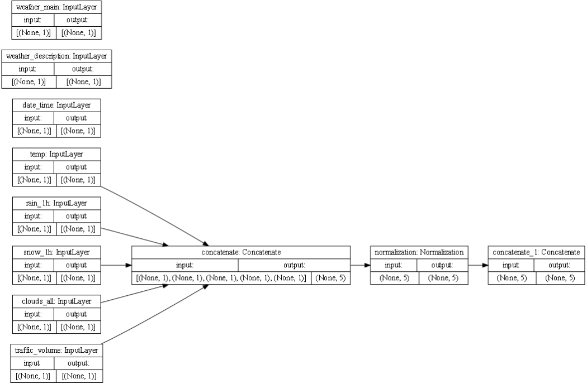
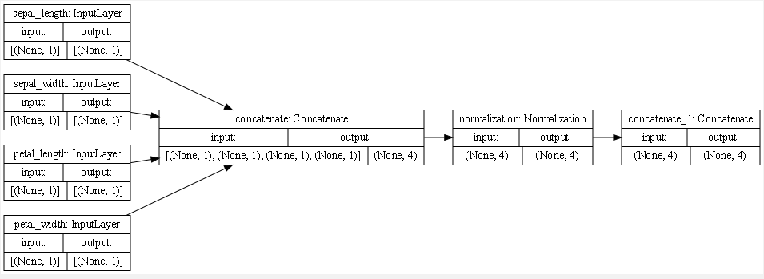

1. METRO INTERSTATE TRAFFIC VOLUME DATASET:
   
    In order to get this dataset to work with the model, I made it into a binary system with the target
   being whether or not it was a holiday by classifying every entry that had 'None' as the holiday as a 1 and
   everything else as 0. 
   
    The loss for the binary model was 0.0088 after 10 epochs.

   Concatenation works to put all the processes pieces of data so they can be read through the model.
   Since the dataset is made up of many different kinds of data, the code attempts to match the names and data types for each
   column and save these as objects. For instance, 'age' gets its own layer and is recognized to be a float with the shape (None,1).
   On the other hand, 'class' is recognized as a string. Before concatenation, all of the numerical values
   are clumped together and normalized. Now the layer with all these features has the shape (None, 4) and makes up its own layer. Next, one-hot coding takes all
   of the features with string outputs and converts them to data more appropriate for the model (floats). The final step takes all of the processed inputs and squishes 
   them together for the model to read through.
   
   Each box in the plot below represents one of these layers to be passed through the model. When they are all concatenated together, the final layer is what passes through
   the model. Each arrow shows when the code condenses a few layers together and the shape of the layer increases. For instance, it puts together the temp, rain, snow, clouds, and volume together because they 
   are all numerical data points. This is important for the model because it allows you to process the different types of data in a simpler manner.

   

2. IRIS DATASET:

    Similar to the traffic dataset, I transformed the species targets into a binary model by making all of the 0 outputs (iris-setosa) into 1s and everything else a 0.

    The loss for the binary iris model was 0.2460 after 10 epochs.

   Because all of the data in this set is numerical and continuous, all four features can combine right away when concatenating them. They can also all be normalized together which will lead
   directly to the last layer for the model to read. (For more info about how the code concatenates, see the traffic section)

   

*For both datasets, I wouldn't use mean squared error to identify the accuracy because the it's a binary classification where the ouputs are either 1 or 0.
In both models, we are just measuring the loss and not the accuracy*