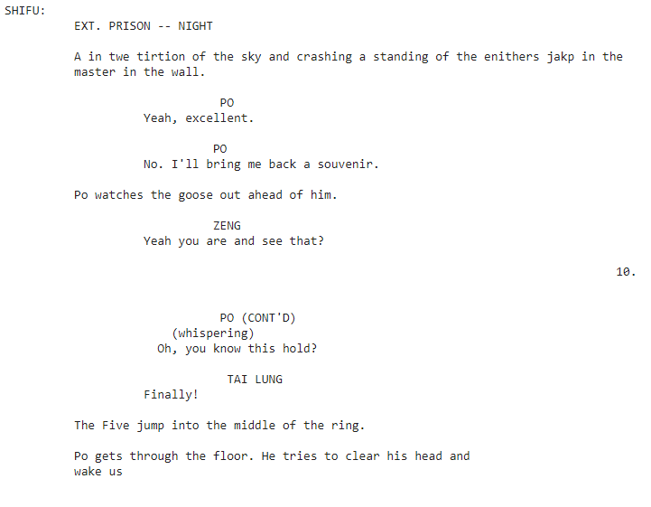

1. Using Thursday's Text Generation Script, I generated lines for *Kung Fu Panda*.
The first step was processing, vectorizing, and predicting text. Vectorizing the data involves
   converting the strings in the script to numerical represetation so the model can easily read and generate
   it. The layer for this uses preprocessing.StringLookup to convert letters to id numbers. In order to reverse 
   this and get the output as strings again, you must invert the StringLookup and rejoin the characters. To
   predict, the model determines the most likely letter based on what comes before it.
   The code divides the text into sample sequences, each with a target that is offset by one letter, and it randomizes
   them and creates batches that can be fed into the model.
   1. To build the model, it uses a layer we haven't seen before: tf.keras.layers.GRU. This is
    part of RNN (with size units=rnn_units) and is used at each timestep to use the previous
      embedding layer information to help the dense layer predict the probability of the next character
      in the sequence. When training the model, you have to optimize (using Adam) and define a loss function (sparse categorical crossentropy in this case).
      For my script, I trained the model using 200 epochs. Generally, the more epochs you use, the 
      more the model will generate accurate sequences.
      
    2. Finally, to generate the text, I ran a loop that took in sample text and its internal state and returned the next most likely
    letter and its new state. The loop caused a longer script sample to be generated. I believe my script has the first 1,000 characters
       that were generated.
   