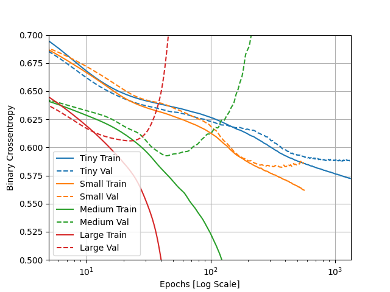
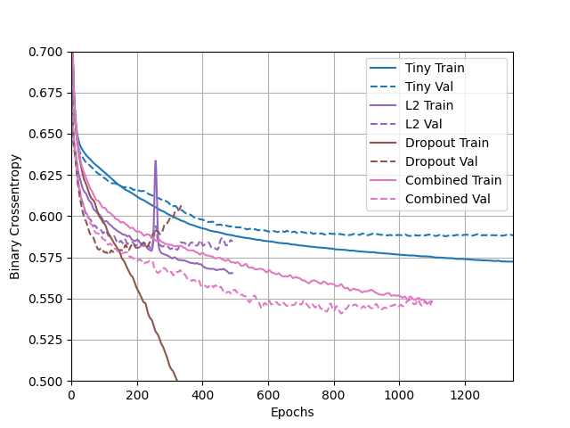

###HIGGS DATASET
1. Describe the dataset. What type of variable is the target? How many features are being used? How many observations
are in the training set? How many are used in the validation set?
   - 

2. How did each of the four models perform (tiny, small, medium and large)? Which of the four models performed the best? Which ones performed the worst? Why in your estimation did certain models perform better? Produce a plot that illustrates and compares all four models.
    
   - The tiny model and small model did the best becuase the training and validation scores for binary crossentropy did not split for the longest time. If the two sets of data split with the training decreasing in entropy and the validation increasing, it means the model is getting more and more overfit because the training score is becoming more accurate but the validation is just turning into nonsense.
    Based on this analysis of the graph, the medium and large models did the worst, with the medium one performing only slightly better than the large.
     The smaller models probably performed better because they were less complex with less data points. When the model is more complex, it it more likely to only learn the exact target for each of the training inputs.
   

3. Apply regularization, then add a drop out layer and finally combine both regularization with a dropout layer. Produce a plot that illustrates and compares all four models. Why in your estimation did certain models perform better?
    
   - The tiny model in this case still did very well, but the combined dropout and L2 regularization model also did well. It's interesting that the binary crossentropy score for the combined model's validation was lower than the score for the training data. This shows that the model is not overfit and was able to attain a fairly good accuracy.
    The model that used only dropout did the worst because 

4. What is an overfit model? Why is it important to address it? What are four different ways we have addressed an overfit model thus far?
    - An overfit model is one that does very well with the training data because it almost memorizes the targets. This means it does significantly worse on the testing or validation data becuase it has trouble applying what it learned from the training data to the new set.
    It's important to address overfit models because at first, they may seem like they are very accurate, but when given new data they don't do nearly as well.
      To minimize overfitting, we have tried controlling the size of the dataset (trying tiny, small, medium, and large with the smaller-sized one working better), dropping some data (dropout), and using L2 regularization.
