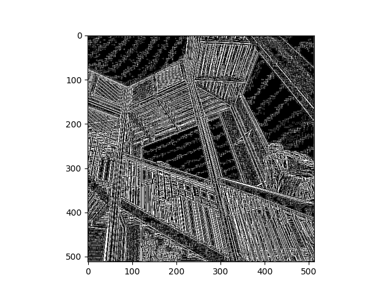
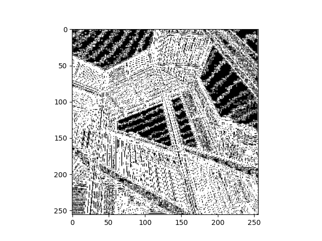
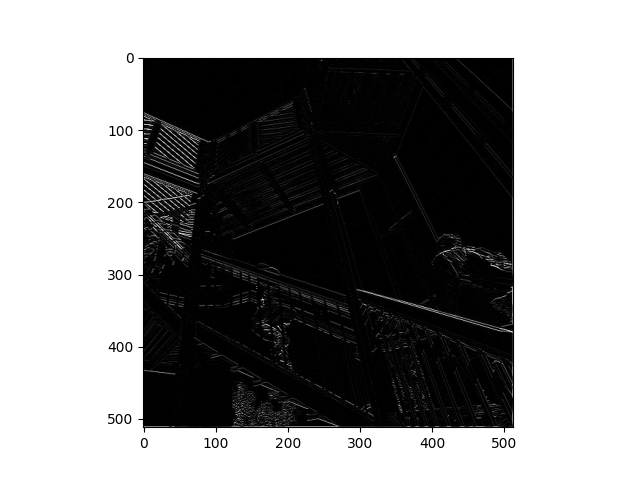
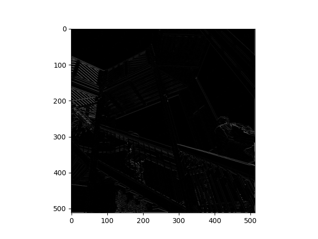
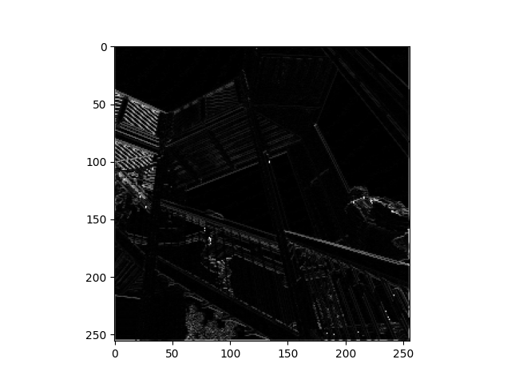

###HIGGS DATASET
1. Describe the dataset. What type of variable is the target? How many features are being used? How many observations
are in the training set? How many are used in the validation set?
   - The data has 11,000,000 total data points each with 28 features. For the training set, we used 10,000 points and for validation, we used 1,000.
    Overall, the target is a continuous variable because they are measurements recorded from particles.

2. How did each of the four models perform (tiny, small, medium and large)? Which of the four models performed the best? Which ones performed the worst? Why in your estimation did certain models perform better? Produce a plot that illustrates and compares all four models.
    
    
   - The tiny model and small model did the best becuase the training and validation scores for binary crossentropy did not split for the longest time. If the two sets of data split with the training decreasing in entropy and the validation increasing, it means the model is getting more and more overfit because the training score is becoming more accurate but the validation is just turning into nonsense.
    Based on this analysis of the graph, the medium and large models did the worst, with the medium one performing only slightly better than the large.
     The smaller models probably performed better because they were less complex with less data points. When the model is more complex, it it more likely to only learn the exact target for each of the training inputs.
   

3. Apply regularization, then add a drop out layer and finally combine both regularization with a dropout layer. Produce a plot that illustrates and compares all four models. Why in your estimation did certain models perform better?
    
   - The tiny model in this case still did very well, but the combined dropout and L2 regularization model also did well. It's interesting that the binary crossentropy score for the combined model's validation was lower than the score for the training data. This shows that the model is not overfit and was able to attain a fairly good accuracy.
    The model that used only dropout did the worst because it had less and less data each time but the same weight distribution, so the conclusions it made became less accurate. The combined model did better than just the drop because it factored in the regularization to control the complexity and adjust the weights.

4. What is an overfit model? Why is it important to address it? What are four different ways we have addressed an overfit model thus far?
    - An overfit model is one that does very well with the training data because it almost memorizes the targets. This means it does significantly worse on the testing or validation data becuase it has trouble applying what it learned from the training data to the new set.
    It's important to address overfit models because at first, they may seem like they are very accurate, but when given new data they don't do nearly as well.
      To minimize overfitting, we have tried controlling the size of the dataset (trying tiny, small, medium, and large with the smaller-sized one working better), dropping some data (dropout), and using L2 regularization to control weights and complexity, and normalizing to make numbers more consistent.

###CONVOLUTIONS AND IMAGE LOADING

*Each image pair is the initial image after convolution and the pooled image*

1. [ [0,100,0], [-100,0,-100], [0,100,0] ]
- Throughout the exercise, we places a lot of emphasis on horizontal and vertical lines,
so I wanted to see the result if I only put diagonal lines in my matrix. I was also curious
  to see how the size of the filter numbers impacted the outcome. After trying many different
  combinations, I tried it with 100s but still made sure it added up to zero so I could keep
  the weight consistent. The higher filter values made the image highlight the lines much more,
  and since most of the lines in the image are diagonal due to the perspective, the filter was
  able to emphasize all of the lines, not just the horizontal or vertical.
  

2. [ [-2,4,-2], [0,0,0], [0,0,0] ]
- After seeing the result of the first matrix, I wanted to know how the size of the numbers mattered
even when it all still added to zero and had the same weight. For the second and third filters, I only
  put numbers in the first row but gave the first filter slightly higher numbers and the second one lower numbers.
  As a result, the image that used the higher numbers had more defined and brighter white lines, which
  shows that the hgiher the number, the bighter the image. If the whole filter was full of 0s, the image
  would most likely be all black because the higher the number, the brighter that pixel will be on the scale.
  The filters used on the second and third images emphasized the horizontal lines, but not as much as a filter with
  values in the top and bottom rows.
  

3. [ [-1,2,-1], [0,0,0], [0,0,0] ]
   

a. After using the 3x3 filters on the original images, it results in one number for each selected 3x3 cell. This essentially summarizes the
data, so there is less variation. Applying the filters and pooling to the images is reducing the size as seen by the axes on the
images. They go from 512x512 to just over 256x256. The convolving filter is useful to computer vision because it simplifies the
image so it can be read while it still has its filters.

