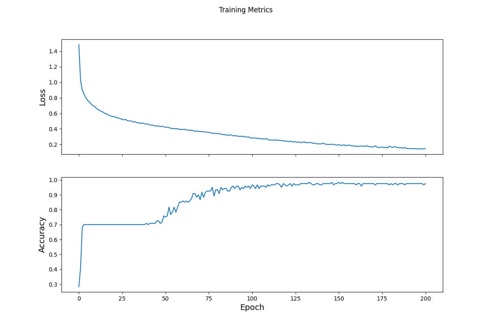

***Iris Dataset Walkthrough***

For this code, we used the iris dataset which contains 4 features 
(sepal length in cm, sepal width in cm, petal length in cm, and petal width in cm) and 
one target which was the species classification. There were three possible species:
Setosa, Versicolor, and Virignica. For all 150 entries, there were 50 flowers for each species.

To create the tf.dataset, I loaded in the data using the csv file (url) and the tf.keras.utils.get_file
command. From there, I had to assign column names but be sure that they were assigned in the
correct order as seen on the CSV file, and I split the columns into the features and the
labels. The model itself was set up using tf.keras.Sequential (to make linear stack of layers)
with three layers of 10 nodes using keras.layers.Dense. The first having an input shape of 4
for the 4 different possible features and the last layer having three for the three different
species labels. This last layer will ultimately return three different probabilities for the 
three possible species. The first and second layer both use tf.nn.relu activations for hidden layers.
However, before running the model, the data must be preprocessed using the make_csv_dataset
function to shuffle and split the data into a manageable format with a batch size of 32 and 1 epoch.
Tf.stack was able to take values from these different batches and put them together to make
the training dataset. The resulting tensors are arrays with the shape following
(batch_size, num_features) because you can choose how many examples you want (batch_size), 
and there are four different values in each individual array for the four different features.

To train the data, I used the tf.keras.losses.SparseCatergoricalCrossentropy function to calculate how
off the model will be from the actual answers (this is called loss). After running the model to get
a test loss value of 1.11, I optimized the data using the tf.GradientTape function to find the gradients
that will best optimize my model. This function takes loss values into account and attempts to find
where they are at their lowest for the training data. The specific gradient algorithm I used was
tf.keras.optimizers.SGD (stochastic gradient descent) with a learning_rate of 0.01. Optimizing 
the model takes several steps to get to the best value. For the first step loss improved to 1.06, so we
created a loop to test several different epoch numbers to find the best loss. At intervals of 50, the
loop would collect the loss value and accuracy of the model (seen in the epoch graph below). As you
can see, the loss decreases over time while the accuracy increases with the addition of more epochs.
Both graphs begin to level off to show that a further increase in epochs would not yield significantly
better results and may even start to become overfit.

Once the model was trained with the first data set, we tried a test set by importing the iris
data again and transforming it into a dataset that could be used by the model (following the same steps
seen above with the make_csv_dataset function). This time when running the model, we only had one
epoch because we just need to compare each entry to its predicted label by the model and its actual
label by using a loop. The accuracy ended up being around 97%.

To make predictions on unlabeled examples, we input our own sepal and petal data as a tensor 
and ran the model, making sure that the loop picked the label with the highest probability for 
each example and displayed it with the correct species name.

    [5.9, 3, 5.1, 1.8,], 
    [7.4, 2.8, 6.1, 1.9,],
    [5.2, 2.3, 1.6, 0.75]

Example 0 prediction: Iris virginica (87.9%)
Example 1 prediction: Iris virginica (90.6%)
Example 2 prediction: Iris setosa (94.5%)
***All are correct***

