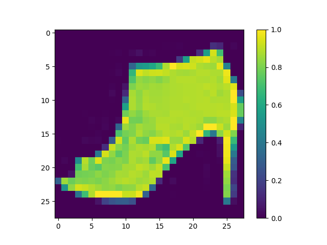
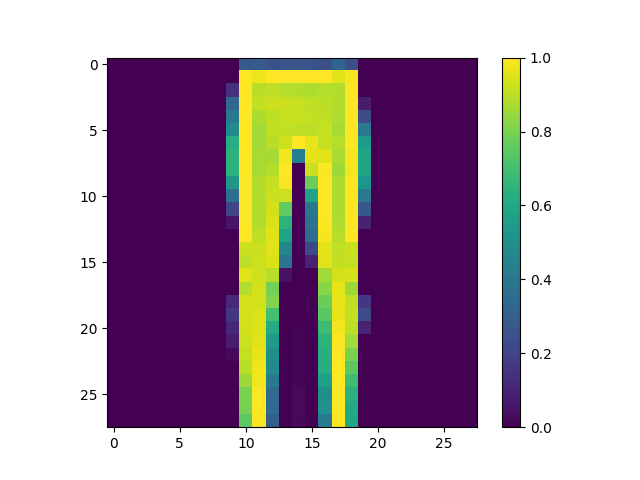
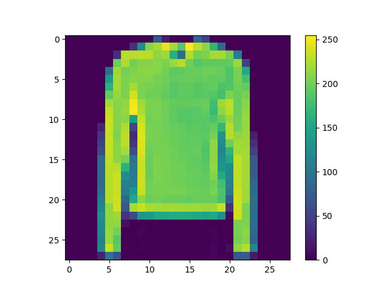
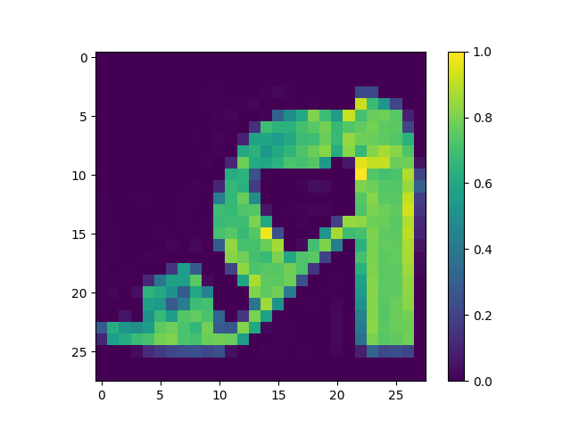
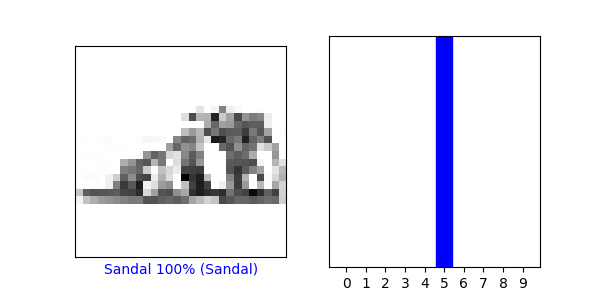
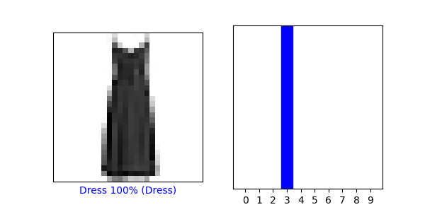
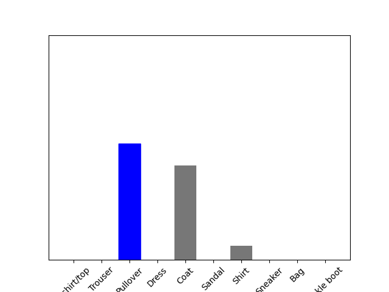
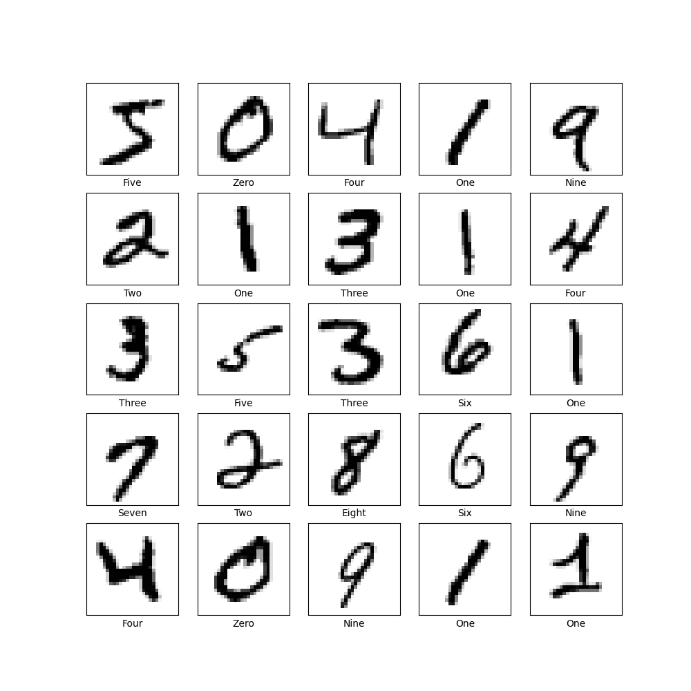
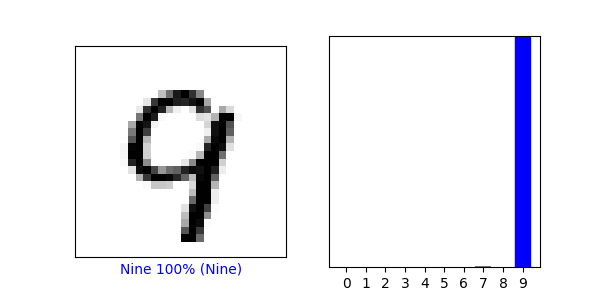
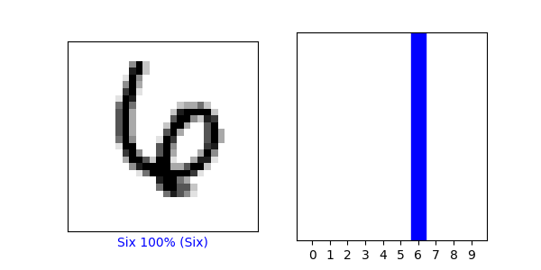

1. 

     

2. 

    
   
   array([5.8389569e-06, 4.8498350e-07, 6.2312815e-02, 4.4064254e-06,
   9.2694354e-01, 1.1861965e-11, 1.0728093e-02, 4.5355267e-13,
   4.8602510e-06, 7.1427810e-09], dtype=float32)
   
   Each number in the array represents the probability that the selected image fits under that corresponding classification.

3. The Softmax() function scales the data so all of the inputs will sum to one in order to produce probabilities of an input/image being in certain classes in this case. The altered values are in the array. 
   
   Argmax() manipulates the data to return the maximum value by changing every value except the highest to a 0 (the max value will be a 1).

4. Argmax() did return the same value as the test_labels dataset (both got 4s).

5. 

    

6. 

   
   
   The predicted value does matche the test label. We didn't use Softmax() this time because it was already used earlier in the code to better distribute the data for the neural network. Argmax() is already using this transformed data to find the maximum probability.
   

7. 

   

    

With the digit data, the accuracy of the testing data was 0.9784 while the fashion testing data had an accuracy of about 0.88. 

The mnist dataset did better than fashion_mnist because the written digits are most distinct than the clothing images and can be more accurately represented by the 28x28 pixels.