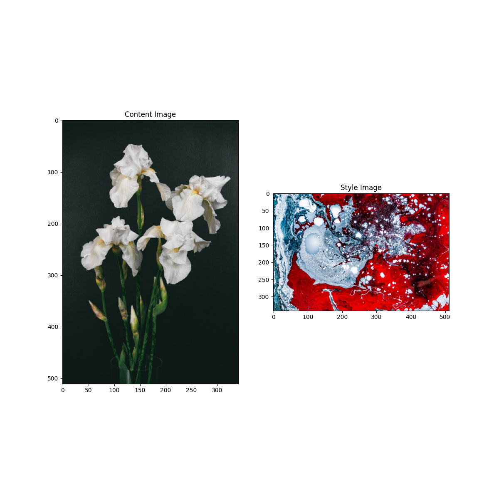

               

1. When applying the style transfer, I tried adjusting several different settings
in the code. For example, I increased the epochs to 5 and increased the steps_per_epoch to 50 and 100.
   I also tried changing/increasing the style_weight (but not the content_weight) to see if the image would become more
   abstract. I think it worked but it was difficult to tell whether it was the different number of steps
   per epoch or the style_weight that was making the small difference. Changing all of these settings
   resulted in slightly different colors being emphasized or different lines in the picture being more or less blurry.
   1. The  first step to implementing the style is to define the content and style representations. 
   To do this, the code uses the VGG19 structure (VGG19 is an image classification network) and takes 
      specifically the middle/intermediate layers to define and understand the images. With each layer of the VGG19, it becomes
      more complex going from edges and lines in the image to specific parts of the image such as petals or eyes. Taking the 
      intermediate layers helps your model understand the pictures and represent their main features.
      
   2. To extract the content, I just used the intermediate layers from above. However, to extract the style, I had to calculate
   the gram matrix which describes the image using means and correlations and uses a feature vector to find the averaged
      product values over the entire image.
      
   3. The style transfer algorithm finds the mean square errors for each section relative to the target output and takes the weighted
   sum of the losses. I made sure to set style and content target values before optimizing using Adam.
      
   4. For the high frequency components, the code applies regularization to decrease these and make it more manageable. To do this,
   the code used the total variation loss. With too many high frequency components, the content image could become almost unrecognizable 
      because even the faintest lines in the picture could be emphasized.
   
2. Of course, I had to choose Irises when reflecting on my time in data science at William and Mary. The first picture 
especially is accurate to my experience because, while it might not be as elegant as the second one, it 
   accurately shows how there were very few straight lines over the course of the summer; classes and projects always 
   required a lot of thought and had their own challenges each time. The colors are a mix of light and dark
   to contrast the good and bad moments and the chaos is definitely accurate for this summer between trying to balance a job, school work, hobbies,
   family, and friends. In the end though, what came out of it was something 
   beautiful that will continue to grow in the future as I continue to pursue data science.